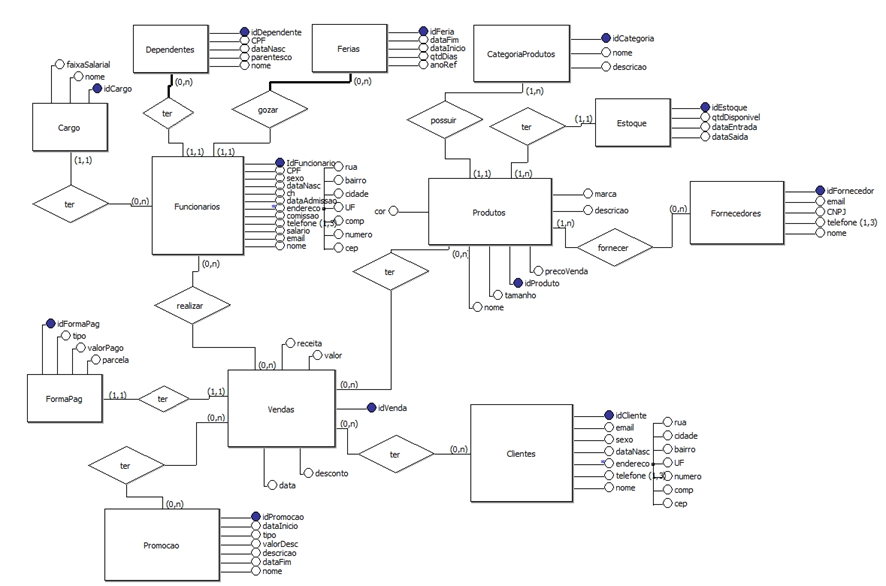
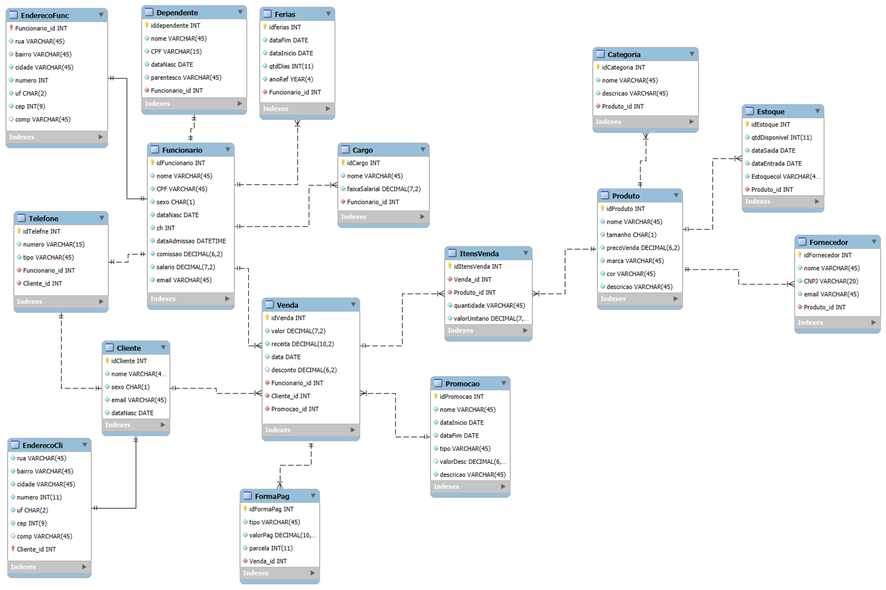

# Projeto Loja de Roupas

Este projeto tem como objetivo detalhar e analisar a logistica de uma loja de roupas para criação de um banco de dados.

### Começando

### Pre-requisitos

- Modelo Entidade Relacional (MER)
- Modelo Relacional (MR)
- Criação do Banco de Dados

### Passos para executar o projeto

**Baixe os seguintes programas**

- brModelo 3.0
- MySQL Workbench
- MySQL Server

### Modelo Entidade Relacional

O Modelo entidade relacional é uma maneira de modelar os dados de um sistema de forma logica e estruturada.

- MER



### Modelo Relacional 

- O modelo relacional é a tradução do modelo de entidade relacional para o formato de tabelas e colunas, que serão implementadas diretamente no banco de dados relacional. Ele define tabelas e seus atributos.

- MR



### Explicação

**Apartir da Criação dos 2 Modelos**

- Podemos agora começar a dar inicio ao nosso Banco de Dados, primeiramente precisamos criar nossas tabelas de forma que sigam o padrão do Modelo Relacional para que não haja conflito futuramente com a inserção de dados

*** Criar Tabela ***
```sql 
    CREATE TABLE EnderecoFunc (
    CREATE TABLE Funcionario (
        idFuncionario INT AUTO_INCREMENT,
        nome VARCHAR(45),
        dataNascimento DATE,
        dataAdmissao DATE,
        sexo CHAR(1),
        email VARCHAR(45),
        PRIMARY KEY (idFuncionario)
);
);
```

- Apos a criação com sucesso da tabela podemos inserir dados dentro dela de forma manual

*** Inserir Dados na Tabela ***

```sql 
    INSERT INTO Funcionario (nome, dataNascimento, dataAdmissao, sexo, email)
    VALUES
    ('Carlos Silva', '1985-05-12', '2020-03-15', 'M', 'carlos.silva@example.com'),
    ('Ana Souza', '1990-11-22', '2019-08-10', 'F', 'ana.souza@example.com'),
    ('João Pereira', '1987-04-10', '2018-05-20', 'M', 'joao.pereira@example.com'),
    ('Maria Oliveira', '1995-01-02', '2021-01-15', 'F', 'maria.oliveira@example.com'),
    ('Pedro Costa', '1982-12-10', '2017-07-30', 'M', 'pedro.costa@example.com'),
    ('Beatriz Santos', '1993-09-14', '2020-02-25', 'F', 'beatriz.santos@example.com'),
    ('Fernando Almeida', '1988-06-18', '2019-04-12', 'M', 'fernando.almeida@example.com'),
    ('Juliana Souza', '1992-03-28', '2021-06-20', 'F', 'juliana.souza@example.com'),
    ('Rafael Lima', '1991-07-11', '2017-11-18', 'M', 'rafael.lima@example.com'),
    ('Camila Rocha', '1989-10-24', '2018-09-05', 'F', 'camila.rocha@example.com');
```

- Apos a inserir os dados na tabelas podemos visualizalos com as views

*** Criação de views ***

```sql
    CREATE VIEW vw_funcionarios_cargos AS
    SELECT f.nome, c.nome AS cargo, c.faixaSalarial
    FROM Funcionario f
    JOIN Cargo c ON f.idFuncionario = c.idFuncionario;

```

Estes são alguns exemplos de formatação de dados em conjuto com o banco de dados.

